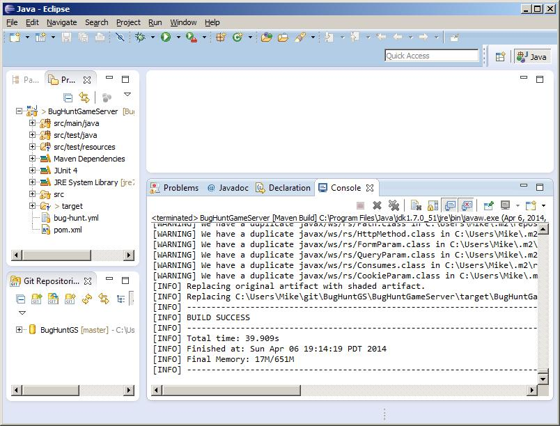
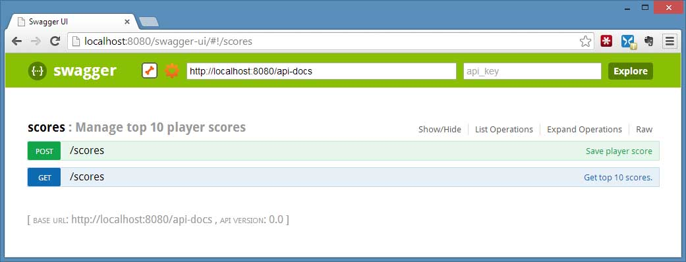

# Bug Hunt Game Server

A working Dropwizard demonstration project. It has a simple API to save player scores and get the top 10 scores. 

It was built in Eclipse using Maven and Git. 
It makes use of [Dropwizard 0.7.0-rc3](https://dropwizard.github.io/dropwizard/) for the restful API. 
[Swagger](https://helloreverb.com/developers/swagger) is used to document the API,
and [dropwizard-swagger](https://github.com/federecio/dropwizard-swagger) for the Swagger user interface to the docs. 
Also makes use of Junit for some unit tests and Logback for logging. 
There's also a [Soap-UI](http://www.soapui.org/) project for even more testing and an alternate to using Swagger-UI to execute the API.

## How To Build It

1. I started with [Eclipse IDE for Java Developers](https://www.eclipse.org/downloads/packages/eclipse-ide-java-developers/keplersr2)
for it's M2E Maven integration. Dropwizard uses Maven for building projects.
You'll also need [JDK1.7](http://www.oracle.com/technetwork/java/javase/downloads/jdk7-downloads-1880260.html) if you don't already have that.

2. Get the Bug Hunt Game Server code from GitHub.
 File -> Import -> Git -> Projects from Git -> Clone URI: `https://github.com/acharraggi/BugHuntGS.git`
 This will create a local Git respository from which you can also create a Eclipse project.
If needed, update that project's Java build path to include the JDK as a JRE is not enough and will create build errors.

3. Then do a Maven Package build. `Run As -> Maven Build` with package as the goal. The first build will download all the related projects like Dropwizard.
 

4. This will build a fat jar that you can run directly from the project's directory.
 `java -jar target/BugHuntGameServer-0.0.1-SNAPSHOT.jar server bug-hunt.yml`

5. View the API documentation at: [http://localhost:8080/swagger-ui/](http://localhost:8080/swagger-ui/).
 Swagger lets you construct API messsages, submit them and view the responses.

 

 An alternate way to execute the API is via Soap-UI. A Soap-UI project file is at:
 `BugHuntGameServer\src\test\soapUI\BugHunt-soapui-project.xml`

